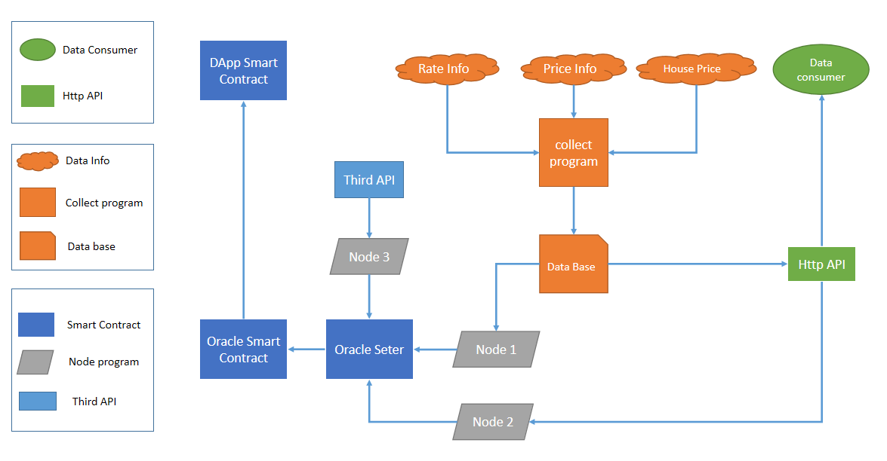

# 开始

## 概述

FAN Oracle将给你的智能合约带来更多的链外数据。

预言机作为连接区块链内外数据的中转站，我们将区块链外部的数据及时的同步到区块的智能合约中，供应有需求的“消费者”直接获得。

**系统整体架构图**

如图所示，整个系统分为四个部分：

- 数据采集：如图橘红色部分。将数字资产价格信息、汇率信息、房价信息等信息进行持续汇总，是预言机系统的基石。
- HTTP API：如图绿色部分。以后端接口形式对外提供查询服务。一方面支持项目以网页形式对外提供查询服务，一方面作为公共接口允许第三方调用查询。
- 节点喂价程序：如图灰色部分。节点程序将**消费者智能合约**所需要的数据，通过预言机传递到链上。
- 预言机：如图蓝色部分。系统核心组件，以两种模式将链下数据提供给需要预言机服务的智能合约。

## 链上预言机服务

- 多种数字资产的实时报价信息

- 美国十大城市房地产抵押贷款利率数据

- 美国十大城市房价变化情况

## 链下数据查询服务

- 全美房地产抵押贷款利率信息查询服务
- 全美房地产抵押贷款利率信息查询接口服务
- 全美房价历史变动情况折线图
- 全美房价历史变动数据查询接口
