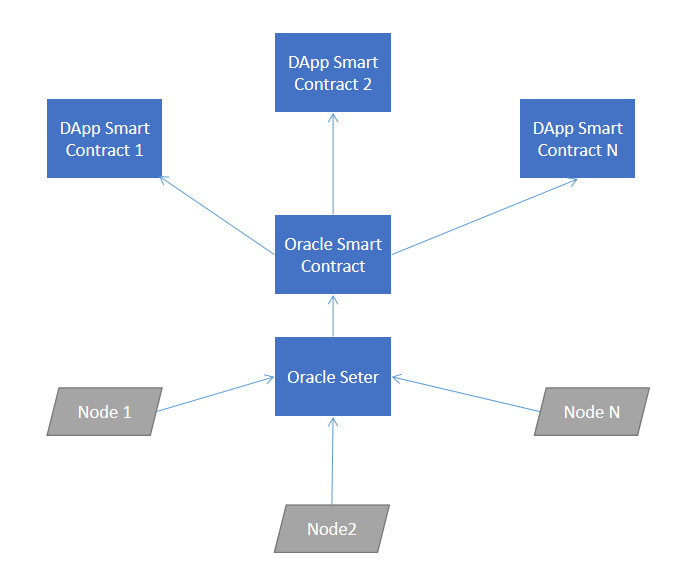
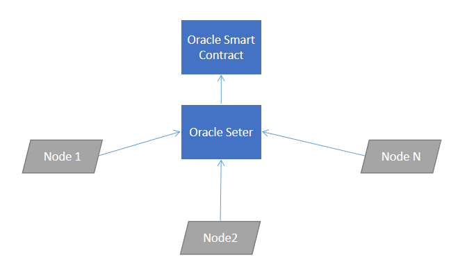

# 分布式数据模式

## 概述

针对数据消费需求比较明确，比如“希望得到某种数字资产的价格”，或更新频次较低的预言机需求，比如“希望得到纽约市的房贷抵押基准利率”等需求。为了让预言机中的数据更加及时、准确、少偏差，我们采用了**分布式数据模式**架构来解决喂价机制问题。



本页面通过“获取最新数字资产价格”的案例来介绍分布式数据模式

### 价格聚合器

图中Oracle Setter即价格聚合器合约。每一个最新的**数字资产报价数据**都是由多个**喂价节点**通过将**数据**发送到**价格聚合器合约**，经合约处理后再更新到**预言机合约**中。



### 共享数据资源

每个价格源都是由依赖于精确的用户社区建立和资助的，并及时的更新价格数据到智能合约中。随着更多的用户依赖或提供价格源数据信息，数据的质量越发的精确、及时。每一种价格数据信息都需要社区的共同维护。

### 分布式预言机喂价节点网络

每个**价格源**都由分散的预言机节点网络负责更新。发布价格数据，目前并不会获得明面上的利益，但精准的价格数据对认同某种数字资产的社区用户来说至关重要。因此相当多的公益节点（喂价节点）应运而生。所有喂价节点均通过社区的运营资质及维护能力的审核后获取发布报价数据的权限。每一个**价格源**的喂价节点数量各有不同，比如OST的**价格源**有9个喂价节点。

为了进行更新，**价格聚合器合约**必须收到来自最少数量的喂价的响应。例如，5/9 个喂价信息。否则最新报价不会被处理并更新至**预言机合约**。

**价格聚合器合约**负责将收集到的价格信息按照**聚合模型**进行处理。最终将偏差最小的报价信息更新至**预言机合约**。

### 聚合模型

当聚合器合约收到报价数据后，会标记本轮报价节点的账户地址信息。每轮次每个喂价节点只允许上报一次数据，直到聚合器合约收集到足够的报价信息进行处理。

喂价节点之间属于竞争关系。越早喂价的节点，其数据能够参与到本轮**数据处理与更新**中。

例如：OST的喂价节点有9个，只要其中5个节点向**聚合器合约**提交了最新数字货币报价，则触发**价格更新机制**，在去掉明显不合理的报价数据后，将最新报价数据更新至**预言机合约**。

## 合约概述

在分布式数据模式下使用预言机会涉及到以下三个合约：

### 消费者合约

一个消费者合约可以是任何想要通过**预言机合约**获取数字资产价格信息的智能合约。

消费者合约只需要简单的引用**预言机接口**，并调用数据获取方法，即可获得最新的数字资产价格信息。

```
interface getPriceInterface {
    function peek() public view returns (uint, bool);
    function read() public view returns (uint)
}

lastestPrice = getPriceInterface(addr).read();
```

### 预言机合约

预言机合约用来保存数据消费者所需的数据到区块链上。只有`被授权`的`聚合器合约`才能更新报价信息。这个过程被定义为**“喂价”**。

### 聚合器合约

聚合器是接收来自多个Oracle的定期价格更新的智能合约。被授权的喂价节点可以将最新数字资产价格提交至本合约。

当聚合器合约收到报价数据后，会标记本轮报价节点的账户地址信息。

每轮次每个喂价节点只允许上报一次数据，直到聚合器合约收集到足够的报价信息进行处理。

可以从 [获取最新报价](../获取数字资产报价/get-the-lastest-price.html) 教程中学习如何快速获取最新数字资产报价